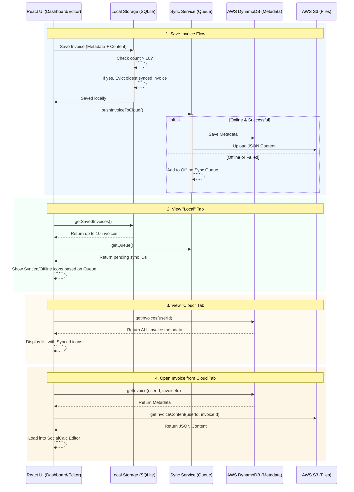

# EdgeBilling Hybrid Storage Architecture

The following Mermaid diagram illustrates the dual-storage strategy (Local First + Cloud Sync) implemented in the application.

> [!NOTE]
> This architecture ensures that the application remains extremely fast and functional offline, while preventing local device storage from bloating by limiting local saves to 10 invoices. All data is eventually persisted to AWS.

### Key Concepts

1. **Local Eviction Strategy**: When a user saves an invoice, the local SQLite database is capped at 10 items. The system queries the `Offline Sync Queue` to ensure it never deletes an invoice that hasn't safely reached the cloud.
2. **Eventual Consistency**: The `Sync Service` catches any failed network requests to AWS. When the network is restored, `flushSyncQueue()` empties the queue and updates DynamoDB/S3.
3. **Lazy Loading**: The Cloud tab fetches *metadata only* from DynamoDB. The heavy `.json` content is only downloaded from S3 when the user explicitly clicks to open an older cloud invoice.
