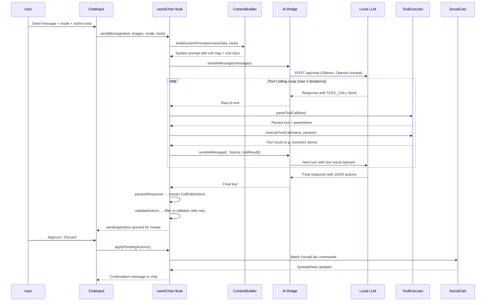
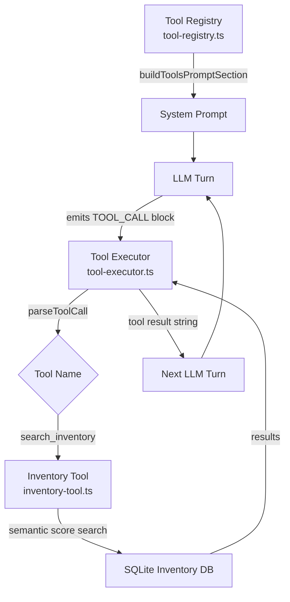
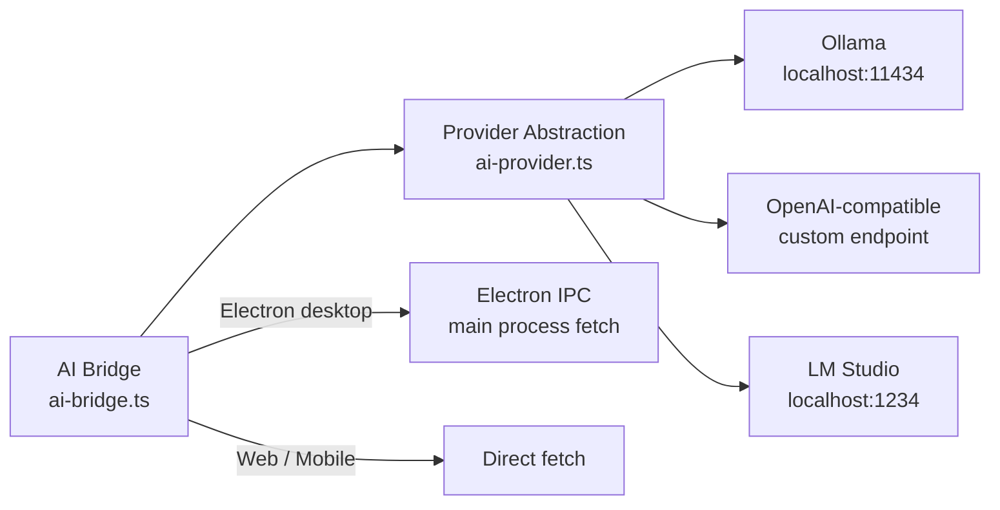
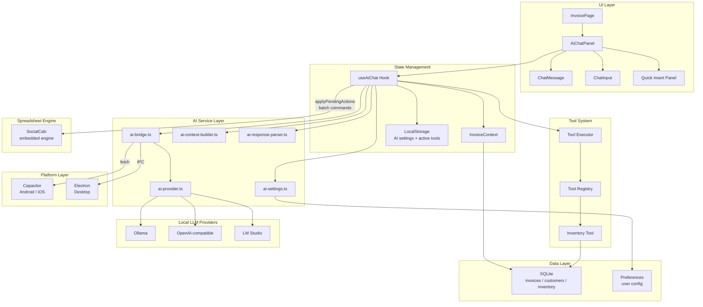
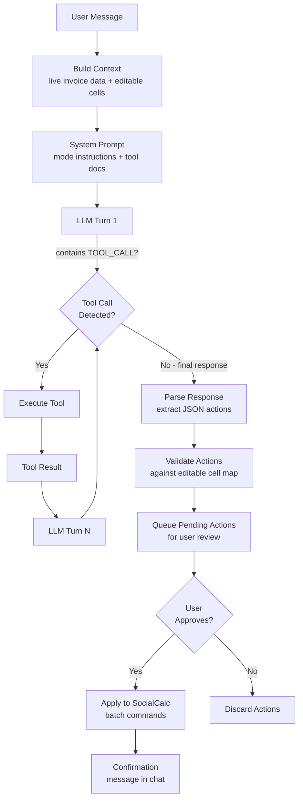
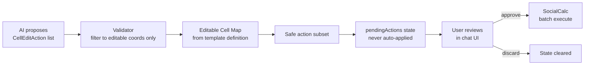

<div align="center">

# Open Invoice Claw


### AI-Powered Offline Invoice Management

[](https://developer.android.com)
[](https://electronjs.org)
[](https://reactjs.org)
[](https://www.typescriptlang.org)
[](https://ionicframework.com)

**Version 2.0.3** — Cross-Platform • Offline-First • Agentic AI

*A professional invoice management app with an embedded agentic AI assistant. Create invoices, manage inventory, and let the AI agent read, analyze, and edit your spreadsheet — all on-device, without cloud dependencies.*

[Download APK](#installation) • [Documentation](#features) • [Report Bug](../../issues)

</div>

---

## Screenshots

<div align="center">
<table>
  <tr>
    <td align="center"><br/><b>Welcome Screen</b></td>
    <td align="center"><br/><b>Business Setup</b></td>
    <td align="center"><br/><b>Invoice Files</b></td>
  </tr>
  <tr>
    <td align="center"><br/><b>Invoice Editor</b></td>
    <td align="center"><br/><b>Quick Edit</b></td>
    <td align="center"><br/><b>PDF Export</b></td>
  </tr>
</table>
</div>

---

## Features

<table>
<tr>
<td width="50%">

### 100% Offline Capable
All data stored locally. No internet needed to create, edit, or export invoices.

### Privacy First
Your financial data never leaves your device. Zero cloud uploads or third-party tracking.

### Spreadsheet Editor
Powered by the embedded SocialCalc engine for flexible, spreadsheet-like invoice creation.

### Professional Templates
Multiple templates with logo and branding customization.

</td>
<td width="50%">

### Agentic AI Assistant
Conversational AI that reads your live invoice, calls tools, and proposes cell edits — requiring your approval before any change is applied.

### PDF Export & Share
Export professional PDFs. Share via email, WhatsApp, or any app.

### Dashboard Analytics
Visual revenue charts and recent invoice tracking.

### Cross-Platform
Runs on Android (Capacitor), Desktop (Electron), and Web.

</td>
</tr>
</table>

---

## Tech Stack

<div align="center">

| Category | Technology |
|:---|:---|
| **UI Framework** | React 19 + Ionic 8 |
| **Language** | TypeScript 5.9 |
| **Build Tool** | Vite 7 |
| **Native Bridge** | Capacitor 8 (iOS / Android) |
| **Desktop** | Electron 35 |
| **Spreadsheet Engine** | SocialCalc (embedded, offline) |
| **Database** | SQLite (via Capacitor plugin) |
| **Local Storage** | Capacitor Preferences + LocalStorage |
| **Animation** | Framer Motion 12 |
| **Charts** | Chart.js 4 + react-chartjs-2 |
| **PDF Export** | jsPDF 4 + html2canvas |
| **Encryption** | Crypto-JS 4 |
| **Testing** | Vitest 4 (unit) + Cypress 13 (E2E) |
| **Linting** | ESLint 9 |
| **AI Runtime** | Ollama / OpenAI-compatible / LM Studio (local LLMs) |

</div>

---

## Agentic AI System

Open Invoice Claw embeds a full agentic AI loop inside the invoice editor. The AI reads live spreadsheet data, selects tools, calls them, synthesizes results, and proposes structured cell edits — all requiring explicit user approval before anything changes.

### How the Agent Works



### AI Modes

| Mode | Behaviour |
|------|-----------|
| `auto` | AI infers the task type from the message |
| `edit` | Focused on proposing targeted cell edits |
| `analyze` | Finds errors, inconsistencies, and gaps |
| `summarize` | Generates a human-readable invoice summary |
| `format` | Fixes spelling, capitalisation, and formatting |

### Tool System

The agent uses a **tool registry** pattern. Tools are defined once and automatically included in the system prompt. The AI emits a structured `TOOL_CALL` block; the executor parses it, runs the tool, and feeds the result back into the next LLM turn.



**Current tools:**

| Tool | Description |
|------|-------------|
| `search_inventory` | Semantic scoring search over products/services. Scores exact name (100pts), word match (40pts), prefix (20pts), substring (10pts). Returns id, name, description, price, stock. |

### AI Provider Abstraction



Providers are configured in the AI Settings panel and persisted to `localStorage`. Switching providers requires no code changes — only an endpoint and model name.

### Context Builder

Before each LLM call, `ai-context-builder.ts` extracts live data from the active SocialCalc sheet and injects it into the system prompt:

- All visible cell values and their spreadsheet coordinates
- Which cells are editable vs read-only (template-defined mapping)
- The next empty row in each table (for appending line items)
- Mode-specific instructions tailored to the selected AI mode

This gives the LLM a grounded, real-time view of the invoice without any server calls.

### Response Parser

`ai-response-parser.ts` uses multiple extraction strategies in priority order:

1. Fenced JSON blocks (` ```json ... ``` `)
2. Raw JSON objects containing action keys
3. JSON arrays with `coord` / `value` shape
4. Natural language patterns (e.g. `set C18 to 'INV-999'`)

All extracted `CellEditAction` objects are then validated against the editable cell map before being surfaced to the user for approval.

---

## Architecture

### Full System Architecture



### Agentic AI Data Flow



### Cell Edit Safety Model



---

## Project Structure

```
open-invoice-claw/
├── android/                    # Native Android project (Capacitor)
├── electron/                   # Electron desktop entry points
├── src/
│   ├── components/
│   │   └── InvoicePage/
│   │       └── AiChat/
│   │           ├── AiChatPanel.tsx     # Main chat UI + Quick Insert tabs
│   │           ├── AiChatPanel.css
│   │           ├── ChatMessage.tsx     # Message rendering + tool cards
│   │           └── ChatInput.tsx       # Input + mode/tool selector
│   ├── services/
│   │   └── ai/
│   │       ├── ai-bridge.ts            # LLM communication layer
│   │       ├── ai-provider.ts          # Provider abstraction (Ollama/OpenAI/LMS)
│   │       ├── ai-context-builder.ts   # Live invoice → system prompt
│   │       ├── ai-response-parser.ts   # JSON action extraction
│   │       ├── ai-settings.ts          # Config persistence
│   │       └── tools/
│   │           ├── tool-registry.ts    # Central tool registry
│   │           ├── tool-executor.ts    # Tool call parsing + execution
│   │           └── inventory-tool.ts   # Semantic inventory search
│   ├── hooks/
│   │   └── useAiChat.ts                # Full agent loop state management
│   ├── types/
│   │   ├── ai.ts                       # AI type definitions
│   │   └── tools.ts                    # Tool system interfaces
│   ├── contexts/                       # React Context providers
│   ├── data/                           # Database repositories
│   ├── pages/                          # App screens
│   └── theme/                          # CSS variables + global styles
├── public/
│   ├── templates/                      # Invoice template definitions
│   └── assets/
├── capacitor.config.ts
├── ionic.config.json
└── package.json
```

---

## Installation

### Option 1: Download APK

1. Download the latest APK from [Releases](../../releases)
2. Enable **Install from Unknown Sources** in Android Settings
3. Install and open the app

### Option 2: Build from Source

**Prerequisites**

- Node.js v18+
- npm
- Android Studio with SDK (for Android build)
- Java JDK 17+ (for Android build)
- Ollama or compatible local LLM server (for AI features)

```bash
# Clone
git clone <repository-url>
cd open-invoice-claw

# Install dependencies
npm install

# Development server (web)
npm run dev

# Build for production
npm run build

# Android
npx cap sync android
npx cap open android

# Desktop (Electron)
npm run electron:dev
```

### Configuring the AI Provider

1. Open the app → Settings → AI Settings
2. Set the **Endpoint** (e.g. `http://localhost:11434` for Ollama)
3. Set the **Model** name (e.g. `llama3.2`, `mistral`, `qwen2.5`)
4. Optionally set an API key for OpenAI-compatible endpoints
5. Save — the AI assistant is ready in any invoice's chat panel

---

## Available Scripts

| Command | Description |
|---------|-------------|
| `npm run dev` | Start Vite dev server |
| `npm run build` | Production build |
| `npm run test` | Run Vitest unit tests |
| `npm run lint` | ESLint check |
| `ionic serve` | Serve with Ionic CLI |
| `npx cap sync android` | Sync web assets to Android |
| `npx cap open android` | Open Android Studio |

---

## Future Work & Ideas

### AI Agent Enhancements

- **Multi-turn memory** — persist conversation context across sessions so the agent remembers prior edits and preferences
- **Vision tool** — let the agent read an uploaded invoice image and extract line items automatically using a multimodal LLM
- **Customer lookup tool** — add a `search_customers` tool so the AI can autofill billing addresses from the customer database
- **Calculation validator** — tool that re-computes totals independently and flags discrepancies between line items and the total cell
- **Tax rules tool** — pluggable tax logic (GST, VAT, HST) the agent can invoke to compute correct tax amounts by region
- **Voice input** — speech-to-text input in `ChatInput` so users can dictate instructions hands-free
- **Streaming responses** — stream LLM tokens into the chat UI for faster perceived response time
- **Agent memory / notes** — let the AI write a scratchpad of facts about the invoice that persists between messages

### Tool Ecosystem

- `generate_invoice_number` — auto-increment invoice IDs following a user-defined pattern
- `fetch_exchange_rate` — pull live FX rates (optional, opt-in network call) for multi-currency invoices
- `validate_tax_id` — format-check GST/VAT/EIN numbers against country patterns
- `suggest_line_items` — recommend items from inventory based on customer history
- **Tool marketplace** — community-contributed tools loadable as plugins without recompiling the app

### Platform & Integration

- **iOS release** — Capacitor build already present; needs signing and App Store configuration
- **Desktop auto-update** — Electron updater for seamless desktop app version bumps
- **Export to Tally / QuickBooks** — structured XML/CSV export matching accounting software formats
- **WhatsApp Business API** — send invoices directly as WhatsApp messages from the share sheet
- **PWA mode** — service worker + manifest for installable web app without app stores
- **Multi-user / team sync** — optional self-hosted sync server for shared invoice databases across devices

### UX & Editor

- **AI diff view** — show a before/after diff of proposed cell changes instead of a plain list
- **Undo AI edits** — one-click undo for the last batch of AI-applied changes
- **Inline AI suggestions** — ghost text suggestions directly in spreadsheet cells (like Copilot in code editors)
- **Template AI generation** — describe a template in plain English and have the agent scaffold the spreadsheet layout
- **Dark mode for chat panel** — currently the chat panel uses a light theme regardless of system preference
- **Pinned quick prompts** — let users save their most-used AI prompts as one-tap buttons

### Infrastructure & Quality

- **Offline LLM bundling** — bundle a small quantized model (e.g. Phi-3 mini GGUF) so AI works with zero external dependencies
- **E2E AI tests** — Cypress tests that mock the LLM and verify the full tool-call → cell-edit pipeline
- **Observability** — optional local logging of AI latency, token counts, and tool hit rates for debugging
- **Accessibility** — ARIA roles and keyboard navigation for the entire chat panel

---

## Contributing

Contributions are welcome. Please open an issue to discuss significant changes before submitting a PR.

1. Fork the repository
2. Create a feature branch: `git checkout -b feature/my-feature`
3. Commit your changes: `git commit -m 'Add my feature'`
4. Push: `git push origin feature/my-feature`
5. Open a Pull Request

---

## License

MIT License — see [LICENSE](LICENSE) for details.

---

<div align="center">

**Open Invoice Claw** — offline invoicing with an on-device AI agent

[]()
[]()
[]()

Star this repo if you find it useful.

</div>
# Invoice-Calc
# Invoice-Calc
# Invoice-Calc
